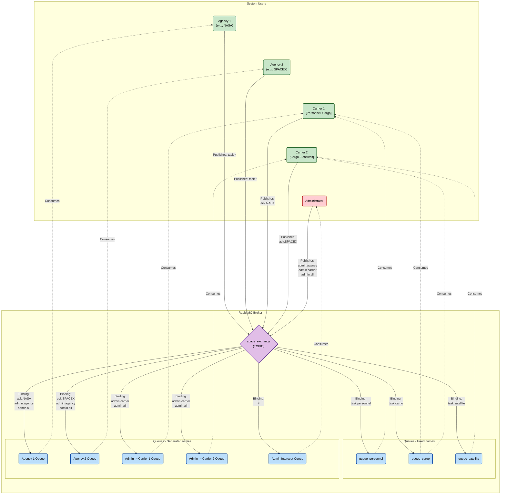

```mermaid
%%{init: {"flowchart": {"nodeSpacing": 120, "rankSpacing": 150}}}%%
graph TD
    %% Style definitions - added color:#000 for perfect contrast
    classDef exchange fill:#e1bee7,stroke:#4a148c,stroke-width:2px,color:#000;
    classDef queue fill:#bbdefb,stroke:#0d47a1,stroke-width:2px,color:#000;
    classDef user fill:#c8e6c9,stroke:#1b5e20,stroke-width:2px,color:#000;
    classDef admin fill:#ffcdd2,stroke:#b71c1c,stroke-width:2px,color:#000;

    %% Users Section
    subgraph System Users
        A1("Agency 1<br>(e.g., NASA)"):::user
        A2("Agency 2<br>(e.g., SPACEX)"):::user
        
        C1("Carrier 1<br>[Personnel, Cargo]"):::user
        C2("Carrier 2<br>[Cargo, Satellites]"):::user
        
        ADM("Administrator"):::admin
        
        %% Hidden links to push nodes apart in the row, preventing clutter
        A1 ~~~ A2
        A2 ~~~ C1
        C1 ~~~ C2
        C2 ~~~ ADM
    end

    %% RabbitMQ Section
    subgraph RabbitMQ Broker
        EX{"space_exchange<br>(TOPIC)"}:::exchange
        
        subgraph Work Queues [Queues - Fixed names]
            QP("queue_personnel"):::queue
            QC("queue_cargo"):::queue
            QS("queue_satellite"):::queue
        end
        
        subgraph Private Queues [Queues - Generated names]
            QA1("Agency 1 Queue"):::queue
            QA2("Agency 2 Queue"):::queue
            QC1("Admin -> Carrier 1 Queue"):::queue
            QC2("Admin -> Carrier 2 Queue"):::queue
            QADM("Admin Intercept Queue"):::queue
        end
    end

    %% 1. TASKS (PUBLISHING) - extended arrows
    A1 --->|"Publishes: task.*"| EX
    A2 --->|"Publishes: task.*"| EX
    
    EX --->|"Binding:<br>task.personnel"| QP
    EX --->|"Binding:<br>task.cargo"| QC
    EX --->|"Binding:<br>task.satellite"| QS

    %% 1. TASKS (CONSUMING) - QoS: 1
    QP -.->|"Consumes"| C1
    QC -.->|"Consumes"| C1
    QC -.->|"Consumes"| C2
    QS -.->|"Consumes"| C2

    %% 2. TASK ACKNOWLEDGMENTS
    C1 --->|"Publishes:<br>ack.NASA"| EX
    C2 --->|"Publishes:<br>ack.SPACEX"| EX

    %% 3. ADMIN MESSAGES (PUBLISHING)
    ADM --->|"Publishes:<br>admin.agency<br>admin.carrier<br>admin.all"| EX

    %% 4. AGENCIES CONSUMING ACKS AND ADMIN MESSAGES
    EX --->|"Binding:<br>ack.NASA<br>admin.agency<br>admin.all"| QA1
    EX --->|"Binding:<br>ack.SPACEX<br>admin.agency<br>admin.all"| QA2
    QA1 -.->|"Consumes"| A1
    QA2 -.->|"Consumes"| A2

    %% 5. CARRIERS CONSUMING ADMIN MESSAGES
    EX --->|"Binding:<br>admin.carrier<br>admin.all"| QC1
    EX --->|"Binding:<br>admin.carrier<br>admin.all"| QC2
    QC1 -.->|"Consumes"| C1
    QC2 -.->|"Consumes"| C2

    %% 6. ADMIN INTERCEPT / SPY
    EX --->|"Binding:<br>#"| QADM
    QADM -.->|"Consumes"| ADM
```